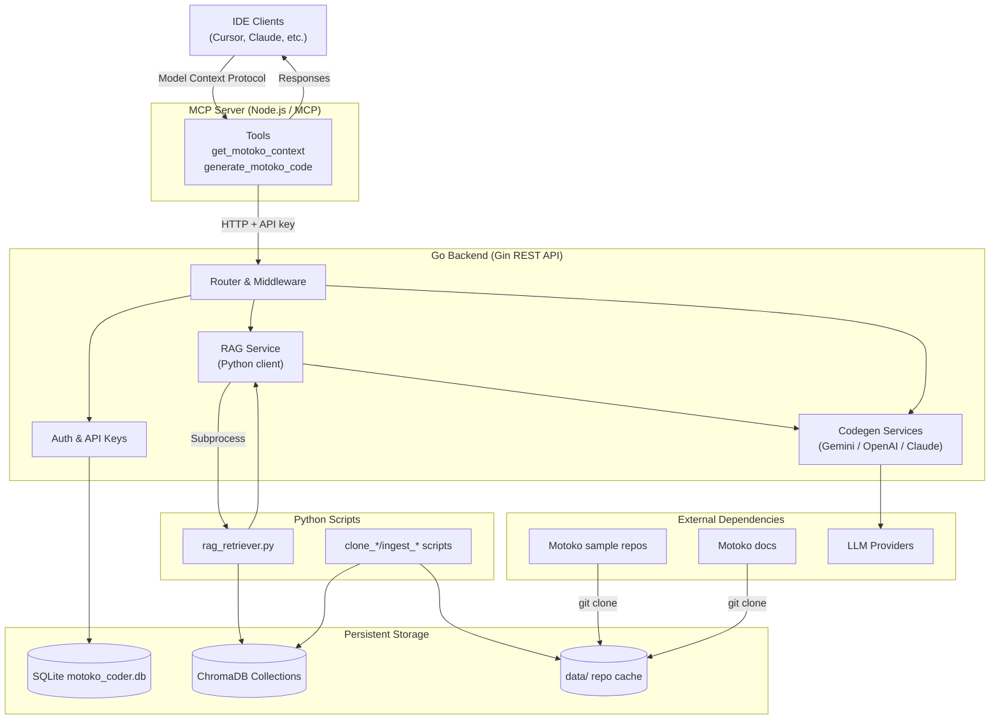

# ICP Coder Architecture

This diagram shows how the IDE integrations, Go backend, Python retrieval layer, storage, and external services work together inside ICP Coder.

**Legend**
- Solid arrows indicate the primary request flow or data movement.
- Subgraphs group components that run within the same runtime or concern.
- Storage nodes with rounded corners represent persistent state managed by the system.
