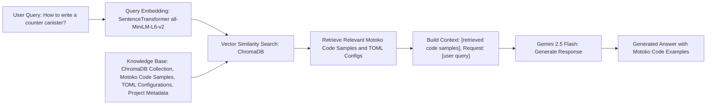
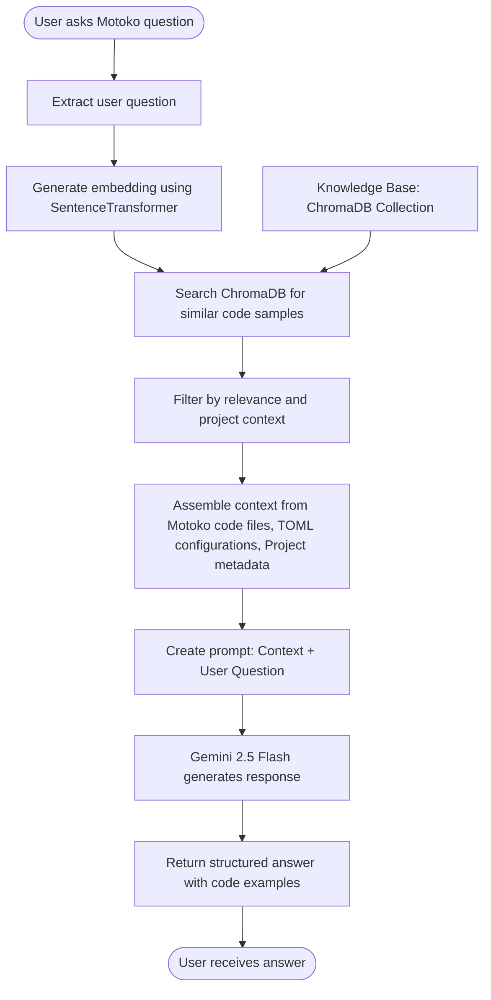
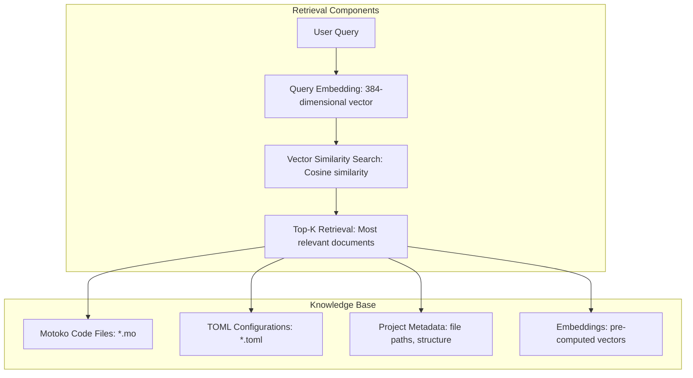
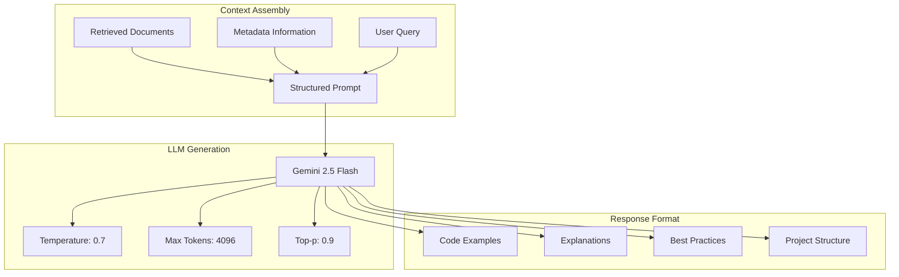

# RAG Approach for Motoko Coder

## Core RAG Architecture

## Detailed RAG Flow

## RAG Components Breakdown

### **1. Retrieval Phase**

### **2. Generation Phase**

## Key RAG Features

### **Enhanced Retrieval**
- **Dual File Types**: Both `.mo` and `.toml` files for complete context
- **Project Awareness**: Understands project structure and dependencies
- **Metadata Enrichment**: File paths, project info, TOML presence indicators
- **Semantic Search**: Uses SentenceTransformer for understanding code meaning

### **Context Assembly**
- **Multi-file Context**: Combines relevant code samples and configurations
- **Structured Prompts**: Clear separation between context and user query
- **Project Metadata**: Includes file locations and project structure info

### **Generation Quality**
- **Gemini 2.5 Flash**: Latest model for high-quality code generation
- **Temperature Control**: Balanced creativity and accuracy
- **Token Management**: Optimized for code generation tasks
- **OpenAI Compatibility**: Standard response format for easy integration

### **Benefits of This RAG Approach**

1. **Accurate Code Generation**: Grounded in real Motoko examples
2. **Project Context**: Understands dependencies and configurations
3. **Up-to-date Knowledge**: Based on current Motoko code samples
4. **Scalable**: Can handle large codebases efficiently
5. **Maintainable**: Easy to update with new code samples 