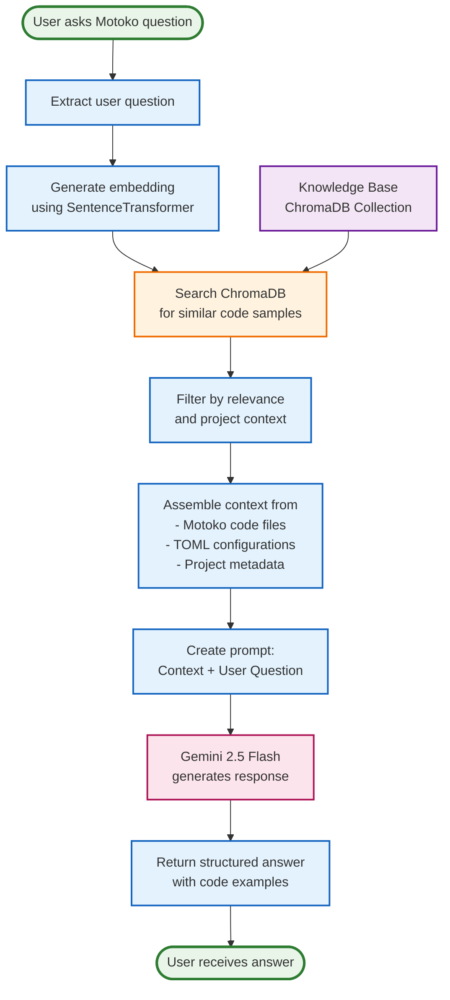
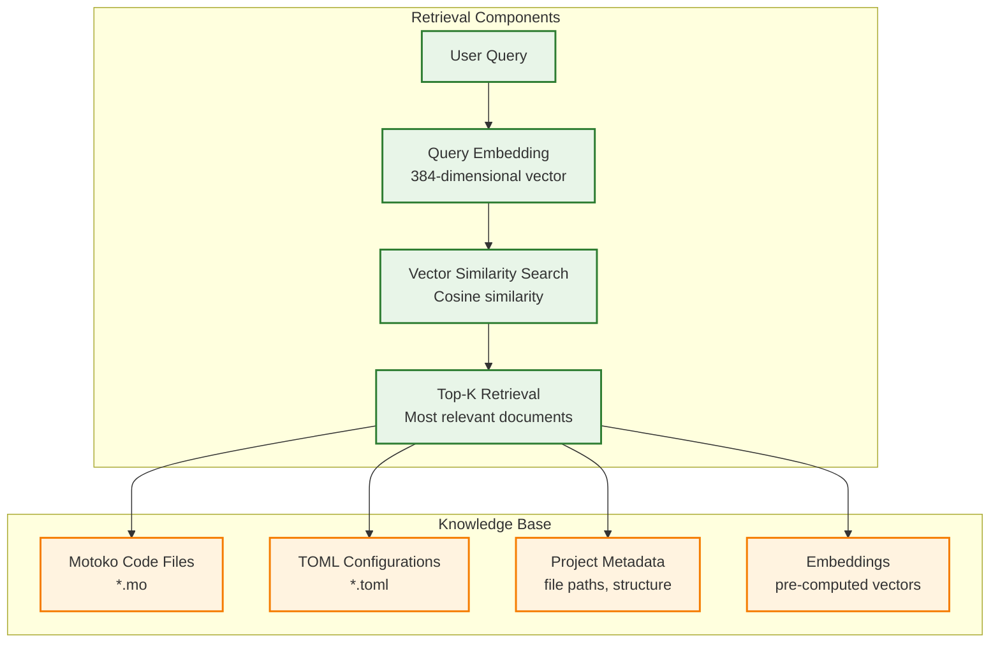
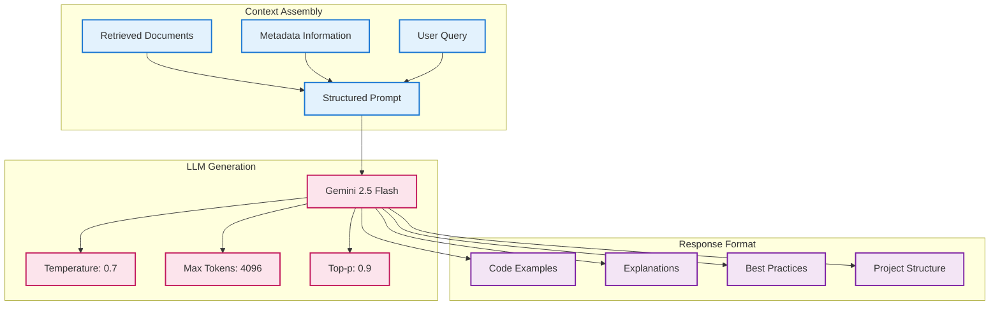

# RAG Approach for Motoko Coder

## Core RAG Architecture

```mermaid
graph LR
    %% User Input
    A[User Query<br/>"How to write a counter canister?"] --> B
    
    %% Query Processing
    B[Query Embedding<br/>SentenceTransformer<br/>all-MiniLM-L6-v2] --> C
    
    %% Vector Search
    C[Vector Similarity Search<br/>ChromaDB] --> D
    
    %% Context Retrieval
    D[Retrieve Relevant<br/>Motoko Code Samples<br/>+ TOML Configs] --> E
    
    %% Context Assembly
    E[Build Context<br/>"Context: [retrieved code samples]<br/>Request: [user query]"] --> F
    
    %% LLM Generation
    F[Gemini 2.5 Flash<br/>Generate Response] --> G
    
    %% Final Output
    G[Generated Answer<br/>with Motoko Code Examples]
    
    %% Knowledge Base
    H[Knowledge Base<br/>ChromaDB Collection<br/>- Motoko Code Samples<br/>- TOML Configurations<br/>- Project Metadata] --> C
    
    %% Styling
    classDef input fill:#e3f2fd,stroke:#1976d2,stroke-width:3px
    classDef process fill:#f3e5f5,stroke:#7b1fa2,stroke-width:3px
    classDef retrieval fill:#e8f5e8,stroke:#388e3c,stroke-width:3px
    classDef generation fill:#fff3e0,stroke:#f57c00,stroke-width:3px
    classDef output fill:#fce4ec,stroke:#c2185b,stroke-width:3px
    classDef knowledge fill:#e0f2f1,stroke:#00695c,stroke-width:3px
    
    class A input
    class B,C,D,E process
    class H knowledge
    class F generation
    class G output
```

## Detailed RAG Flow



## RAG Components Breakdown

### **1. Retrieval Phase**


### **2. Generation Phase**


## Key RAG Features

### **Enhanced Retrieval**
- **Dual File Types**: Both `.mo` and `.toml` files for complete context
- **Project Awareness**: Understands project structure and dependencies
- **Metadata Enrichment**: File paths, project info, TOML presence indicators
- **Semantic Search**: Uses SentenceTransformer for understanding code meaning

### **Context Assembly**
- **Multi-file Context**: Combines relevant code samples and configurations
- **Structured Prompts**: Clear separation between context and user query
- **Project Metadata**: Includes file locations and project structure info

### **Generation Quality**
- **Gemini 2.5 Flash**: Latest model for high-quality code generation
- **Temperature Control**: Balanced creativity and accuracy
- **Token Management**: Optimized for code generation tasks
- **OpenAI Compatibility**: Standard response format for easy integration

### **Benefits of This RAG Approach**

1. **Accurate Code Generation**: Grounded in real Motoko examples
2. **Project Context**: Understands dependencies and configurations
3. **Up-to-date Knowledge**: Based on current Motoko code samples
4. **Scalable**: Can handle large codebases efficiently
5. **Maintainable**: Easy to update with new code samples 