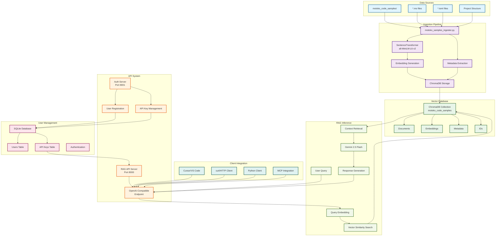
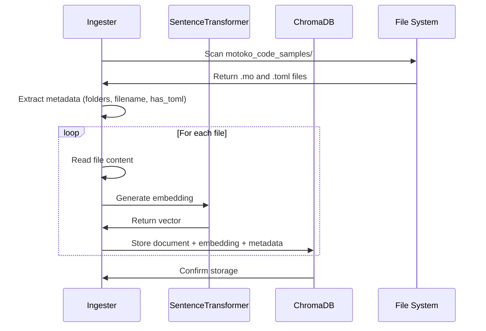
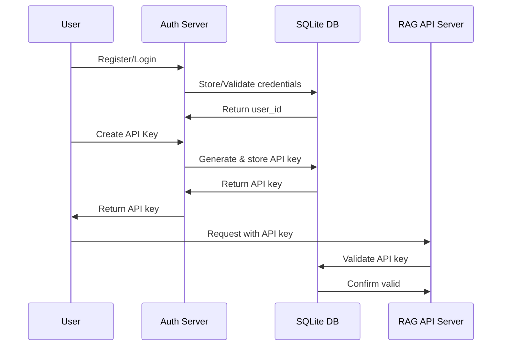
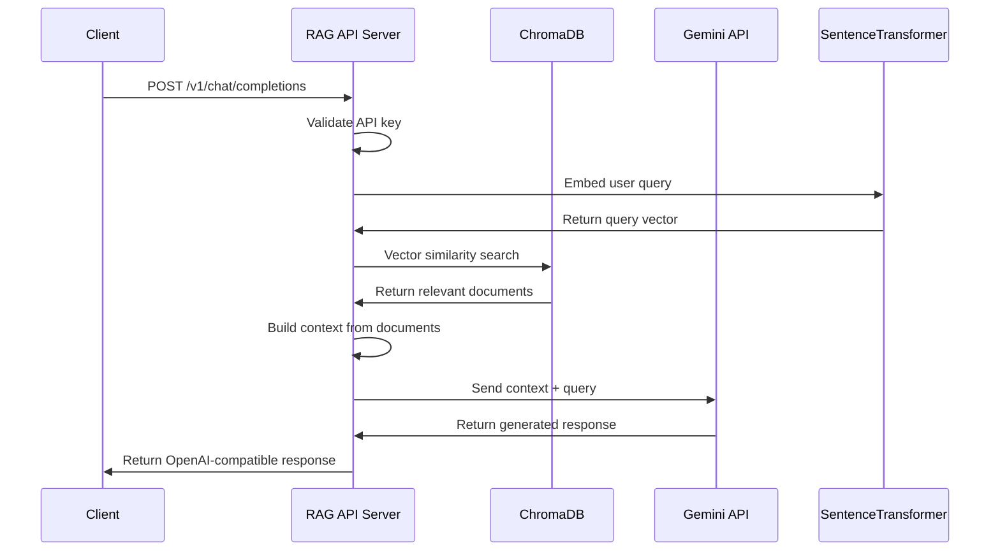

# Motoko Coder RAG Pipeline

## Complete System Architecture

## Detailed Process Flow

### 1. **Data Ingestion Phase**

### 2. **User Authentication & API Key Management**

### 3. **RAG Inference Process**

## Key Components Explained

### **Data Sources**
- **Motoko Code Samples**: Collection of `.mo` files from various projects
- **TOML Configuration**: Project dependency files (`mops.toml`, `dfx.json`)
- **Project Structure**: Directory organization and metadata

### **Ingestion Pipeline**
- **File Discovery**: Recursively finds all `.mo` and `.toml` files
- **Embedding Generation**: Uses SentenceTransformer for vector embeddings
- **Metadata Extraction**: Captures file paths, project structure, and TOML presence
- **Database Storage**: Stores in ChromaDB with proper indexing

### **Vector Database (ChromaDB)**
- **Documents**: Raw file contents (Motoko code + TOML configs)
- **Embeddings**: 384-dimensional vectors from SentenceTransformer
- **Metadata**: File paths, project info, file types, TOML indicators
- **IDs**: Unique identifiers for each document

### **API System**
- **Authentication Server**: User registration, login, API key management
- **RAG API Server**: OpenAI-compatible endpoint for code generation
- **Database Integration**: SQLite for user management, ChromaDB for vectors

### **RAG Inference**
- **Query Processing**: User questions about Motoko development
- **Vector Search**: Semantic similarity search in ChromaDB
- **Context Assembly**: Relevant code samples and configurations
- **LLM Generation**: Gemini 2.5 Flash generates responses
- **Response Format**: OpenAI-compatible JSON structure

### **Client Integration**
- **Cursor/VS Code**: Direct integration as OpenAI endpoint
- **HTTP Clients**: curl, Python requests, etc.
- **MCP Support**: Model Context Protocol integration
- **Custom Clients**: Any OpenAI-compatible client

## Benefits of This Architecture

1. **Comprehensive Context**: Includes both code and configuration files
2. **Scalable**: Can handle large numbers of code samples
3. **Secure**: User authentication and API key management
4. **Compatible**: Works with existing OpenAI-based tools
5. **Flexible**: Supports multiple client types and integration methods 